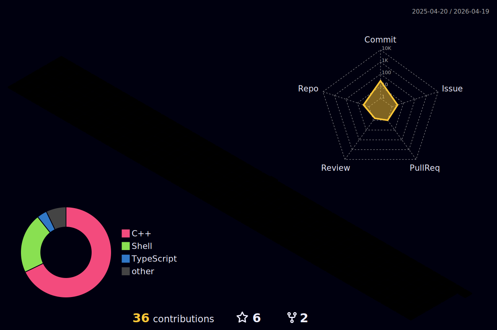

## About Me

I am a Principal Key Expert for Cloud Technologies and Developer Advocate at [Siemens Xcelerator](https://www.siemens.com/global/en/products/xcelerator.html?gclid=CjwKCAjws7WkBhBFEiwAIi16865UEGkx_7uCo2vDprCYi08eBztI500790PMdKH_CarYOZLHnkMB4hoCEskQAvD_BwE&acz=1).

## My GitHub Contributions

Siemens ❤️ Open Source! Click on the badges below to find about our Siemens powered [open source projects](https://opensource.siemens.com)!

### Siemens Open Source Manifesto

Siemens has resolved to be an active and reliable member in the Open Source ecosystem. We aim to benefit our customers, employees, and the company, while contributing to the wider community. We recognize the central role of Open Source in promoting software reuse in our growing digital world, which is an increasingly important contribution in our effort to responsibly handle resources.

Have a look at Siemens [Open Source Manifesto](https://opensource.siemens.com/manifesto/).

### Siemens Developer Portal 

We are excited to announce the launch of our new [developer portal](https://developer.siemens.com)! With help of our developer portal, you can create powerful and innovative applications that take advantage of our API products. We're excited to see what you build!

Our developer portal contains following resources:

* An [API catalog](https://developer.siemens.com/apis.html) with detailed documentation for all of our APIs
* [Developer documentation](https://developer.siemens.com/docs.html) that covers everything from getting started to advanced topics
* A [variety of developer resources](https://developer.siemens.com/resources/index.html), such as SDKs, libraries, and design systems

We hope you find this portal helpful! Visit it today at developer.siemens.com.

We're always looking for ways to improve our developer portal, so please don't hesitate to provide feedback. You can do this by [leaving a comment on this post](https://community.siemens.com/t/siemens-developer-portal/115).

Thank you for your support!

