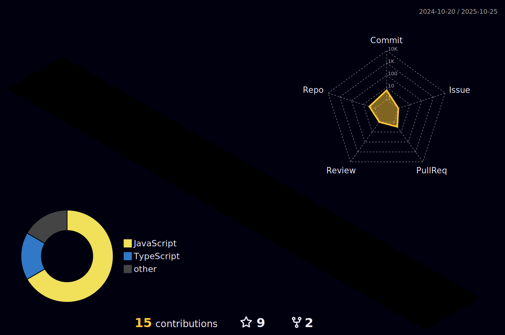

Siemens ❤️ Open Source! Click on the badges below to find about our Siemens powered [open source projects](https://opensource.siemens.com)!

### Siemens Open Source Manifesto

Siemens has resolved to be an active and reliable member in the Open Source ecosystem. We aim to benefit our customers, employees, and the company, while contributing to the wider community. We recognize the central role of Open Source in promoting software reuse in our growing digital world, which is an increasingly important contribution in our effort to responsibly handle resources.

Have a look at Siemens [Open Source Manifesto](https://opensource.siemens.com/manifesto/).
